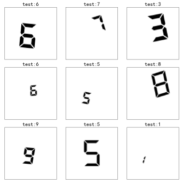
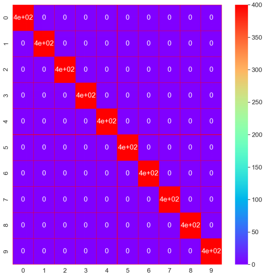
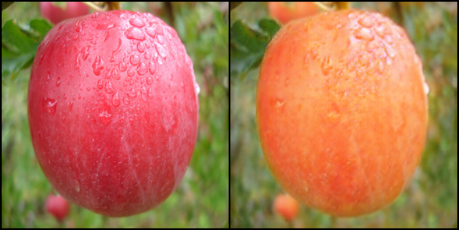
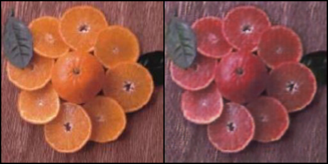

# 深度学习实验

深度学习练习实验

- 图像分类
- LSTM
- GAN
- 迁移学习

## 图像分类

电子屏数字识别：使用卷积神经网络识别电子屏数字，下图是使用加入了[残差结构](https://arxiv.org/pdf/1512.03385.pdf)的网络的识别结果以及对应的混淆矩阵。由于识别任务较为简单，验证集上的准确率达到了100%

## LSTM

某次[Kaggle 竞赛](https://www.kaggle.com/c/stayalert)的数据集

## GAN

apple2orange：将苹果转换成橘子，使用cycle gan，参考论文的[源码](https://github.com/junyanz/pytorch-CycleGAN-and-pix2pix)自己重新搭了一遍，没有预训练和进一步的图像预处理，感觉效果欠佳...。下图是训练了大概100个epoch的结果

- 自己搭建的代码没有像源代码一样随机取之前训练过的图像再到判别器训练。
- 因为设备性能原因，把生成器和判别器做了大幅简化。

## 迁移学习

分类华夫饼和冰淇淋，使用resnet50，尝试冻结了不同层数的网络进行训练，比较训练结果。

# 数据集来源

[图像分类：电子屏数字数据集](https://www.kaggle.com/jakubfrydrych/digits-segment-display) ：数据集的创建者希望通过MNIST尝试创建在设备上显示的数字的识别。数据集包括了0到9的不同大小和旋转角度的电子屏样式的数字。

[LSTM：stayalert数据集](https://www.kaggle.com/c/stayalert)：本数据集来自Kaggle的一次竞赛，数据集由福特公司提供，该数据显示了许多组“试验”的结果，每一次试验代表持续大约2分钟的驾驶过程，这些数据在道路上或驾驶模拟器中每100毫秒记录一次，数据的特征字段包括了驾驶过程中驾驶员的生理指标，某些环境指标和车辆指标，可能出于某些考虑，这些指标的实际名称和测量单位在本任务中没有披露。实验使用LTMS判断驾驶员在一个连续的驾驶过程中的每个记录是否处于警惕状态。

[GAN：Apple2Orange数据集](https://people.eecs.berkeley.edu/~taesung_park/CycleGAN/dataset)：Apple2Orange数据集包含1261个苹果的照片和1267个橙子的照片。这两个域都被划分为训练和测试子集。本实验使用gan将苹果图片转换成橘子图片。

[迁移学习：分类华夫饼和冰淇淋](https://www.kaggle.com/sapal6/waffles-or-icecream)：这些图像是从谷歌图像搜索中提取的。有两个文件夹叫“华夫饼”和“冰淇淋”。“华夫饼”文件夹包含355张不同大小的图片。这个“冰淇淋”文件夹包含了343张不同大小的图片。图像可能包含水印或文本叠加。

